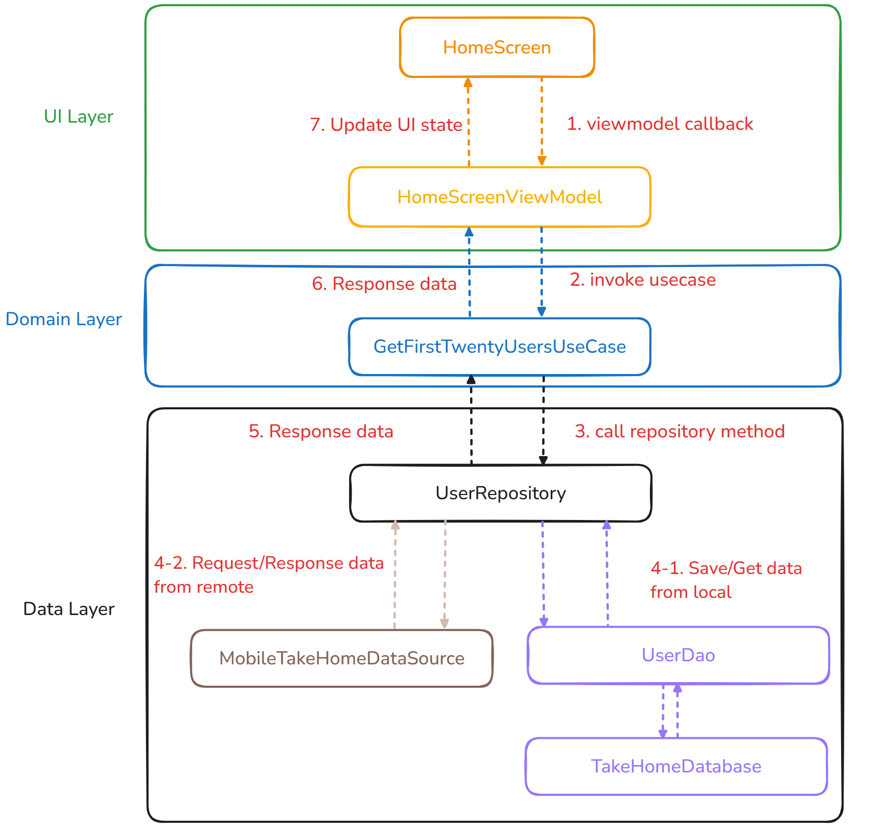
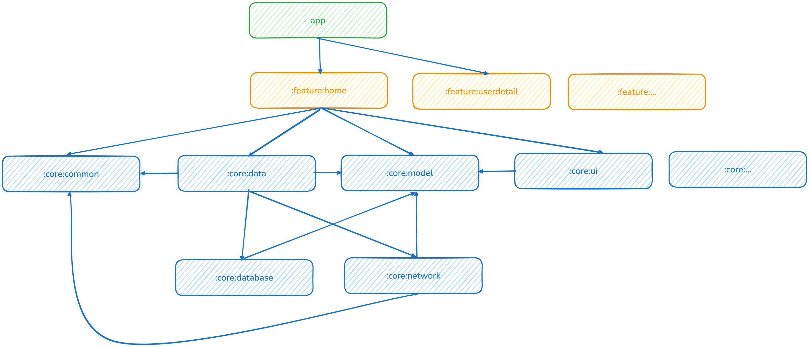

# Application Architecture Overview

This document provides a high-level overview of the application architecture, broken down into different layers and modules.

## 1. Layered Architecture

The application follows a three-layer architecture:

* **UI Layer (Presentation Layer):** This layer is responsible for handling user interactions and displaying data to the user. It sends events to the Domain Layer and receives data to update the UI.
* **Domain Layer (Business Logic Layer):** This layer contains the core business logic and use cases of the application. It receives requests from the UI Layer and interacts with the Data Layer to retrieve and manipulate data.
* **Data Layer:** This layer is responsible for managing data sources, including local databases and remote APIs. It provides data to the Domain Layer.

## 2. Data Flow Example
The first image illustrates a typical data flow within this architecture:

1.  The `HomeScreen` in the UI Layer triggers an action, leading to a `viewmodel callback` in the `HomeScreenViewModel`.
2.  The `HomeScreenViewModel` then `invokes usecase` in the Domain Layer (specifically, `GetFirstTwentyUsersUseCase`).
3.  The use case calls a `repository method` in the Data Layer (`UserRepository`).
4.  The `UserRepository` interacts with data sources:
    * `Save/Get data from local` via `UserDao` and `TakeHomeDatabase`.
    * `Request/Response data from remote` via `MobileTakeHomeDataSource`.
5.  The Data Layer returns `Response data` to the Domain Layer.
6.  The Domain Layer processes the data and returns `Response data` to the UI Layer.
7.  The `HomeScreenViewModel` receives the data and updates the `UI state` of the `HomeScreen`.

## 3. Module Structure

The third image shows a modular structure of the application:

* **app:** The main application module.
* **feature:** Different feature modules (e.g., `featurehome`, `featurecounterdetail`, `feature...`). These likely contain the UI and view models for specific features.
* **core:** Core modules that provide common functionality:
    * `core.common`: Likely contains common utilities and base classes.
    * `core.data`: Might handle data-related abstractions.
    * `core.model`: Defines the data models used throughout the application.
    * `core.ui`: Could contain reusable UI components.
    * `core...`: Potentially other core modules.
    * `core.database`: Handles local database interactions.
    * `core.network`: Handles network communication.

The `app` module depends on the various `feature` modules, and the `feature` modules depend on the `core` modules. There are also dependencies within the `core` modules, such as `core.data` depending on `core.database` and `core.network`, and `core.model` being used by both `core.data` and potentially other `core` modules.